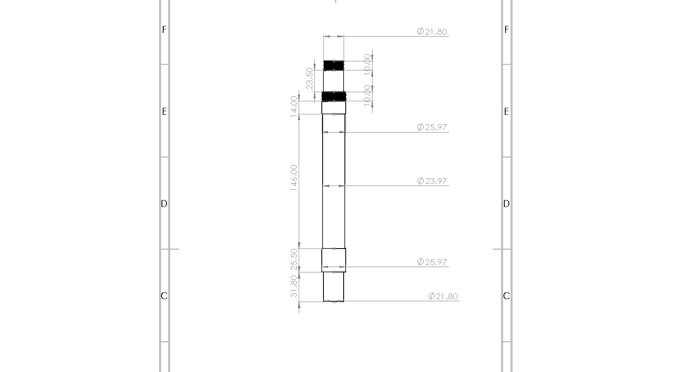

# Steering stem de moto

Stem modificado para que quepa en la pipa de la Transalp 600 y poder usar las tijas de la Husaberg FE 501 para montar horquillas invertidas WP.

## Estructura

- `crf/`: version CRF, con modelos y archivos de SolidWorks.
- `husaberg/`: version Husaberg, con fotos, modelos, G-code y archivos de SolidWorks.

Los archivos temporales `~$*` se conservan localmente, pero no se versionan.

## Fotos

