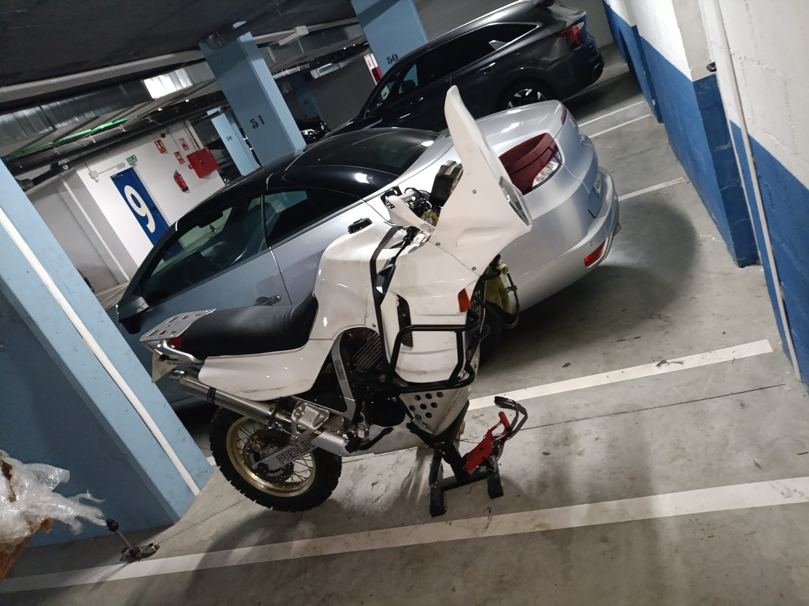

# Steering stem de moto

Stem modificado para que quepa en la pipa de la Transalp 600 y poder usar las tijas de la Husaberg FE 501 para montar horquillas invertidas WP.

## Estructura

- `crf/`: version CRF, con modelos y archivos de SolidWorks.
- `husaberg/`: version Husaberg, con fotos, modelos, G-code y archivos de SolidWorks.

Los archivos temporales `~$*` se conservan localmente, pero no se versionan.

## Fotos

## Medidas

- [Medida 01](husaberg/medidas/medida_01.jpg)
- [Medida 02](husaberg/medidas/medida_02.jpg)
- [Medida 03](husaberg/medidas/medida_03.jpg)
- [Medida 04](husaberg/medidas/medida_04.jpg)
- [Medida 05](husaberg/medidas/medida_05.jpg)
- [Medida 06](husaberg/medidas/medida_06.jpg)
- [Medida 07](husaberg/medidas/medida_07.jpg)
- [Medida 08](husaberg/medidas/medida_08.jpg)
- [Medida 09](husaberg/medidas/medida_09.jpg)
